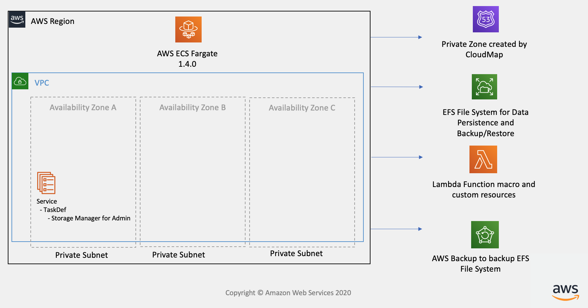
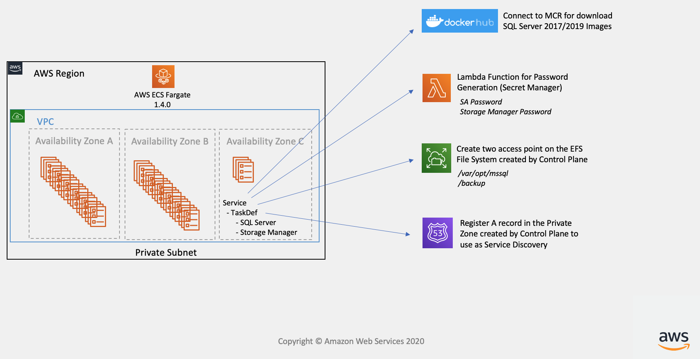

# AWS Dev fabric for SQL Server

The AWS Dev fabric for SQL Server is a solution that helps customers significantly reduce Amazon EC2 heavy lifting on Development Environments, allowing customers to quickly scale to hundreds of thousands of SQL Server Instances in minutes as well as reducing EC2 Windows License and MSDN licensing costs.

- [How to deploy the solution](#how-to-deploy-the-solution)
  - [Control plane](#control-plane)
  - [Data plane](#data-plane)
- [Architecture](#architecture)
- [Contributing to the project](#contributing-to-the-project)
- [License](#license)

#### Security disclosures

If you think you’ve found a potential security issue, please do not post it in the Issues.  Instead, please follow the instructions [here](https://aws.amazon.com/security/vulnerability-reporting/) or email AWS security directly at [aws-security@amazon.com](mailto:aws-security@amazon.com).


## How to deploy the solution

The solution deployment is fully automated in [CloudFormation](https://aws.amazon.com/cloudformation/). Before deploying, you will need to **pack** the templates, a process that will [upload local artifacts to an S3 bucket](https://docs.aws.amazon.com/AWSCloudFormation/latest/UserGuide/using-cfn-cli-package.html). This will consolidate the project templates for seamlessly deploying the solution.

Regarding the parameters, you will find self explanatory comments and parameter names while deploying the solution through the AWS Web Console.

### Step by step

1. Locate an S3 bucket, where CloudFormation templates will be stored. This Bucket **must** be in the same region were you will deploy the solution. If using Linux or MacOS, you can export the variables for smooth usage:

```
export the_region=<your-aws-region>
export the_bucket=<your-selected-s3-bucket>
```

2. Clone the repository

```
git clone https://github.com/aws-samples/aws-dev-fabric-for-sql-server.git
```

... or [download](https://github.com/aws-samples/aws-dev-fabric-for-sql-server/archive/master.zip) it directly as a zip.

3. Step into the repository folder

```
cd aws-dev-fabric-for-sql-server
```

#### Control plane

- **Package ...**
```
aws --region=$the_region cloudformation package --template-file ./control-plane/control-plane.yaml --s3-bucket $the_bucket --output-template-file ./packaged-control-plane.yaml
```

- **Deploy ...**

You can use the [AWS Web console to deploy](https://docs.aws.amazon.com/AWSCloudFormation/latest/UserGuide/cfn-console-create-stack.html)! Upload the **packaged-control-plane.yaml** file. Alternatively, you can deploy via CLI as well:
```
aws --region=$the_region cloudformation create-stack \
       --template-body file://packaged-control-plane.yaml \
       --stack-name <the-stack-name> \
       --disable-rollback \
       --capabilities CAPABILITY_AUTO_EXPAND CAPABILITY_NAMED_IAM \
       --parameters \
       ParameterKey=TheVPCID,ParameterValue="<the-vpc>" \
       ParameterKey=SubnetPrivateAZ1,ParameterValue="<subnet-prviate-1>" \
       ParameterKey=SubnetPrivateAZ2,ParameterValue="<subnet-prviate-2>"
```

#### Data plane

- Package ...
```
aws --region=$the_region cloudformation package --template-file ./data-plane/data-plane.yaml --s3-bucket $the_bucket --output-template-file packaged-data-plane.yaml
```

- Deploy ...

You can use the [AWS Web console to deploy](https://docs.aws.amazon.com/AWSCloudFormation/latest/UserGuide/cfn-console-create-stack.html)! Upload the **packaged-data-plane.yaml** file. Alternatively, you can deploy via CLI as well:

```
aws --region=$the_region cloudformation create-stack \
       --template-body file://packaged-data-plane.yaml \
       --stack-name <the-stack-name> \
       --disable-rollback \
       --capabilities CAPABILITY_AUTO_EXPAND CAPABILITY_NAMED_IAM
```


## Architecture

The SQL Server Dev Fabric allows you to create a fleet of SQL Server 2017/2019 Developer Edition running on **Ubuntu 16.04/18.04** on top of Amazon Elastic Container Service (ECS Fargate). The solution helps customers reduce all the heavy-lift imposed by using EC2 or/and ECS + EC2 Deployment (OS Patching, Management, Hardening, Snapshots and AMI Lifecycle), allowing customers to quickly scale up to thousands SQL Server Instances in minutes, with SQL Server Auto-Recovery and Data Persistence. The solution splits into two modules.

#### Control plane

Ideally, you would have one **Control Plane** deployed per AWS region. This setup takes care of creating and provisioning all the common and underlying resources for the solution to work:

- Checks and validates that input subnets are private.
- Creates the [ECS Cluster](https://docs.aws.amazon.com/AmazonECS/latest/developerguide/clusters.html).
- Creates the [EFS shared filesystem](https://aws.amazon.com/efs/) and the [backup policies](https://docs.aws.amazon.com/efs/latest/ug/efs-backup-solutions.html).
- Provisions other CloudFormation resources required for the solution setup, such as [Custom Resources](https://docs.aws.amazon.com/AWSCloudFormation/latest/UserGuide/template-custom-resources.html) and [Macros](https://docs.aws.amazon.com/AWSCloudFormation/latest/UserGuide/template-macros.html).



#### Data plane

You can deploy as many data planes as you require. This deployment allows you to provision **N** unique databases. Each of them will have a dedicated set of resources, unique and isolated:

- A Docker container for running the database engine.
- A portion/directory within the EFS volume for storing the data.
- A dedicated web access for retrieving and adding files to the engine.
- Its own set of unique and randomly generated passwords.
- Its own IAM roles and permissions.

This is useful for creating multiple and isolated environments with similar setups, in minutes.

You can later deploy new and different instances of the Data Plane, specifying different engine versions, capabilities, permissions, etc.




## Contributing to the project

Contributions and feedback are welcome! Proposals and pull requests will be considered and responded. For more information, see the [CONTRIBUTING](https://github.com/aws-samples/aws-dev-fabric-for-sql-server/blob/master/CONTRIBUTING.md) file.

Amazon Web Services does not currently provide support for modified copies of this software.


## License

The AWS Dev fabric for SQL Server solution is distributed under the [MIT-0 License](https://github.com/aws/mit-0). See [LICENSE](https://github.com/aws-samples/aws-dev-fabric-for-sql-server/blob/master/LICENSE) for more information.
